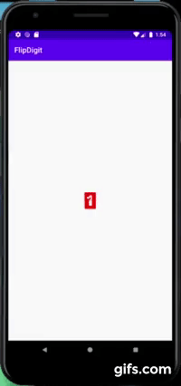

# Flip digit library

  Flip digit Library makes a cool and flexible animation when changing from one numbers to another
  
[](https://jitpack.io/#aldrek/Flip_Digit)
[](https://www.android.com)
[](https://android-arsenal.com/api?level=21)

# 

## :hammer: Setup
 In your ``` build.gradle:```

```Gradle
dependencies {
   implementation 'com.github.aldrek:Flip_Digit:1.0.1'
}
```

## Usage
  
  Use this in xml 
  
```xml 
 <com.aldrek.digitflip.FlipDigit
   android:id="@+id/digit"
   android:layout_width="wrap_content"
   android:layout_height="wrap_content"
   app:isFastFlip="true"
   app:tintColor="#FF0000"
   app:layout_constraintBottom_toBottomOf="parent"
   app:layout_constraintEnd_toEndOf="parent"
   app:layout_constraintStart_toStartOf="parent"
   app:layout_constraintTop_toTopOf="parent"
   ></com.aldrek.digitflip.FlipDigit>
```

  <h4>  Use this in code for <h4>   <h2> Single digit </h2>
   
   Kotlin
     
  ```java 
  
   var i = 0
   
   object : CountDownTimer(30000, 1000) {
       override fun onTick(millisUntilFinished: Long) {

          filipSingle.setDigit(i , true)
            i++
          }

            override fun onFinish() {
            }
    }.start()
  ```

  Java
   
  ```java 
   
   int i = 0;
   
   new CountDownTimer(10000, 1000) {

      public void onTick(long millisUntilFinished) {
           digit.setDigit(i*2 , true);
      }

       public void onFinish() {
      }

    }.start();
   ```

  # Attributes

  | Attribute | Description |
| --- | --- |
| `isFastFlipMain` | enable change flip number from one number to another without going thought all the numbers in between |
| `tintColor` | change the background color of digit |
| `numberOfDigits` | change the number of digits for the widget |
| `digitColor` | change all the background of digits in widget ) 

## License
Copyright 2018 aldrek . All rights reserved.

Licensed under the Apache License, Version 2.0 (the "License");
you may not use this file except in compliance with the License.
You may obtain a copy of the License at

     http://www.apache.org/licenses/LICENSE-2.0

Unless required by applicable law or agreed to in writing, software
distributed under the License is distributed on an "AS IS" BASIS,
WITHOUT WARRANTIES OR CONDITIONS OF ANY KIND, either express or implied.
See the License for the specific language governing permissions and
limitations under the License.
